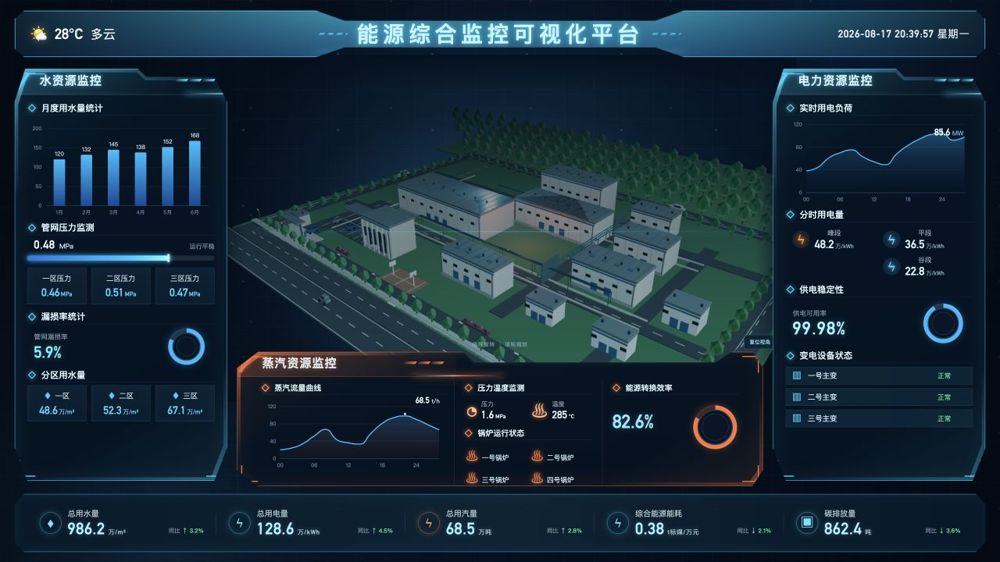

# 能源综合监控可视化平台

面向工业园区能源管理场景的 React + Three.js 可视化大屏。中心区域使用 Blender 生成的厂区 GLB，支持建筑选择、整栋楼层爆炸拆分、环厂交通、停车场和闸门车辆通行动画。



## 功能

- 水、电、蒸汽等能源指标和趋势图表
- 可旋转、缩放的半写实工业园区
- 12 栋可点击建筑及楼层业务信息
- 点击建筑后所有楼层同步爆炸展开
- 建筑外壳消隐、楼层发光轮廓和能量轴效果
- 四周环形道路、道路车辆、停车场和门卫闸机
- 车辆识别、等待开杆、通行、清场落杆的同步闸门周期
- 日间 / 傍晚照明模式及道路、立面灯具联动
- 响应式 16:9 大屏及减少动态效果适配

## 技术栈

- React 18
- Three.js
- ECharts
- Vite 5
- Blender 5.2 LTS / glTF 2.0
- Node.js 内置测试运行器

## 本地启动

```bash
npm install
npm run dev -- --host 0.0.0.0 --port 5180
```

打开 [http://localhost:5180/](http://localhost:5180/)。

生产构建：

```bash
npm run build
```

## 场景交互

- 拖拽：旋转园区视角
- 滚轮：缩放视角
- 点击建筑：打开建筑信息并同步展开全部楼层
- 点击楼层：镜头进入该层三面剖切空间，显示功能分区、家具/设备和行走人员
- 合拢楼层：恢复建筑楼层结构
- 日间 / 傍晚：切换园区环境曝光、雾、主光及运行灯具
- 复位视角：返回前左方向的园区总览

## Blender 模型

厂区模型采用 Blender 参数化建模并导出为 glTF 2.0。当前模型不是单纯的白盒占位：在保留参考图总体布局的基础上，已经补充建筑墙板分缝、基座、檐口、窗带、装卸门、屋顶设备及管廊等工业建筑构造；主要建筑按楼层拆分，并在楼层内部布置生产设备、检修设施、办公家具和行走人员，供 Web 端爆炸分层及内部视角使用。

室外场景包含环厂道路、内部车道、路缘石、排水沟、斑马线、方向标线、停车位与挡轮器、门卫闸机和动态车辆。绿化采用工业园区的秩序型设计，包括外围树列、内部乔木、树池、雨水花园、灌木和观赏草；闸门车辆通道及入口视线范围设有无树净空区。

主要资产：

- `assets/blender/factory-campus-graybox.blend`：可编辑 Blender 源文件
- `public/models/factory-campus-graybox.glb`：Web 端加载的模型
- `tools/blender/create_factory_campus_graybox.py`：确定性模型生成脚本
- `docs/BLENDER_GRAYBOX.md`：模型结构和运行时约定

生成脚本是模型结构的维护入口。需要修改建筑、道路或绿化时，应先更新生成脚本及场景合同测试，再重新生成 `.blend` 和 `.glb`，避免手工编辑结果在下一次导出时丢失。

在 macOS 上重新生成模型：

```bash
/Applications/Blender.app/Contents/MacOS/Blender \
  --background \
  --python tools/blender/create_factory_campus_graybox.py \
  -- \
  --blend-output assets/blender/factory-campus-graybox.blend \
  --glb-output public/models/factory-campus-graybox.glb
```

GLB 中的可交互节点遵循以下命名规则：

- 建筑：`BLDG__<building-id>`
- 楼层：`FLOOR__<building-id>__<floor-id>`
- 室内功能区：`ZONE__<building-id>__<floor-id>__<zone-id>`
- 立面构件：`FACADE__<building-id>__*`
- 屋面收边与排水：`ROOF__<building-id>__*`、`SERVICE__<building-id>__*`
- 闸门识别与交通设施：`GATE__recognition-zone`、`GATE__stop-line`、`GATE__speed-bump-*`、`GATE__lane-arrow-*`
- 动态闸门车辆：`VEHICLE__gate-shuttle__root`

楼层爆炸动画、三面剖切房间、内部检查灯光和聚焦镜头由 Web 端 Three.js 控制；Blender 负责提供可独立移动的楼层节点、功能区、内部物体和人员动画元数据。闸杆与车辆共同消费 `gateTrafficCycle` 状态机，确保车辆在识别区等待、闸杆开启后通行、清场后落杆。启用“减少动态效果”时，人员/车辆停止，闸杆恢复关闭。

GLB 预算上限为 15 MiB（15,728,640 字节），当前树木通过链接网格和对象尺度变化控制体积；不得为此模型增加运行时外部纹理请求。

## 测试

Web 功能与场景合同：

```bash
npm test
```

Blender 模型合同测试建议单并发运行，避免同时启动多个 Blender 进程：

```bash
node --test --test-concurrency=1 tools/blender/create_factory_campus_graybox.test.js
```

测试覆盖建筑节点、楼层元数据、内部设施、建筑间距、墙面构造、道路与停车设施、绿化层次、闸门入口净空、车辆动画、相机方向和 GLB 加载回退。

完整交付检查：

```bash
npm test
node --test --test-concurrency=1 tools/blender/create_factory_campus_graybox.test.js
npm run build
test $(stat -f%z public/models/factory-campus-graybox.glb) -le 15728640
git diff --check
```

Blender 合同测试在同一进程中复用一次完整生成结果，随后分别检查 GLB 节点、布局、PBR 材质、构造立面、室内层级和绿化指标，避免重复启动多个 Blender 实例。

## 目录

```text
assets/blender/     Blender 源模型
docs/               模型说明与实施记录
public/models/      Web GLB 资产
src/components/     React 界面组件
src/hooks/          Three.js 场景生命周期
src/scene/          园区注册表、资产加载与动画逻辑
tests/              Web 场景测试
tools/blender/      Blender 生成器及模型合同测试
```
